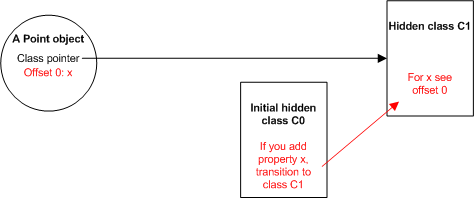

JavaScript's integration with Netscape Navigator in the mid 1990s made it much easier for web developers to access HTML page elements such as forms, frames, and images. JavaScript quickly became popular for customizing controls and adding animation and by the late 1990s the vast majority of scripts simply swapped one image for another in response to user-generated mouse events.

More recently, following the arrival of AJAX, JavaScript has become a central technology for implementing web-based applications such as our very own GMail. JavaScript programs have grown from a few lines to several hundred kilobytes of source code. While JavaScript is very efficient in doing the things it was designed to do, performance has become a limiting factor to further development of web-based JavaScript applications.

V8 is a new JavaScript engine specifically designed for fast execution of large JavaScript applications. In several [benchmark](https://developers.google.com/v8/benchmarks) tests, V8 is many times faster than JScript (in Internet Explorer), SpiderMonkey (in Firefox), and JavaScriptCore (in Safari). If your web application is bound by JavaScript execution speed, using V8 instead of your current JavaScript engine is likely to improve your application's performance. How big the improvement is depends on how much JavaScript is executed and the nature of that JavaScript. For example, if the functions in your application tend to be run again and again, the performance improvement will be greater than if many different functions tend to run only once. The reason for this will become clearer as you read the rest of this document.

There are three key areas to V8's performance:

- [Fast Property Access](#fast-property-access)
- [Dynamic Machine Code Generation](#dynamic-machine-code-generation)
- [Efficient Garbage Collection](#efficient-garbage-collection)

# Fast Property Access

JavaScript is a dynamic programming language: properties can be added to, and deleted from, objects on the fly. This means an object's properties are likely to change. Most JavaScript engines use a dictionary-like data structure as storage for object properties - each property access requires a dynamic lookup to resolve the property's location in memory. This approach makes accessing properties in JavaScript typically much slower than accessing instance variables in programming languages like Java and Smalltalk. In these languages, instance variables are located at fixed offsets determined by the compiler due to the fixed object layout defined by the object's class. Access is simply a matter of a memory load or store, often requiring only a single instruction.

To reduce the time required to access JavaScript properties, V8 does not use dynamic lookup to access properties. Instead, V8 dynamically creates hidden classes behind the scenes. This basic idea is not new - the prototype-based programming language Self used maps to do something similar. (See for example, [An Efficient Implementation of Self, a Dynamically-Typed Object-Oriented Language Based on Prototypes](http://research.sun.com/self/papers/implementation.html)). In V8, an object changes its hidden class when a new property is added.

To clarify this, imagine a simple JavaScript function as follows:

```js
function Point(x, y) {
  this.x = x;
  this.y = y;
}
```

When `new Point(x, y)` is executed a new `Point` object is created. When V8 does this for the first time, V8 creates an initial hidden class of `Point`, called `C0` in this example. As the object does not yet have any properties defined the initial class is empty. At this stage the `Point` object's hidden class is `C0`.


Executing the first statement in `Point` (`this.x = x;`) creates a new property, `x`, in the `Point` object. In this case, V8:

creates another hidden class `C1`, based on `C0`, then adds information to `C1` that describes the object as having one property, `x`, the value of which is stored at offset `0` (zero) in the `Point` object.
updates `C0` with a class transition indicating that if a property `x` is added to an object described by `C0` then the hidden class `C1` should be used instead of `C0`. At this stage the `Point` object's hidden class is `C1`.



Executing the second statement in `Point` (`this.y = y;`) creates a new property, `y`, in the `Point` object. In this case, V8:

- creates another hidden class `C2`, based on `C1`, then adds information to `C2` that describes the object as also having property `y` stored at offset `1` (one) in the `Point` object.
- updates `C1` with a class transition indicating that if a property `y` is added to an object described by `C1` then the hidden class `C2` should be used instead of `C1`. At this stage the `Point` object's hidden class is `C2`.


It might seem inefficient to create a new hidden class whenever a property is added. However, because of the class transitions the hidden classes can be reused. The next time a new `Point` is created no new hidden classes are created, instead the new `Point` object shares the classes with the first `Point` object. For example, if another `Point` object is created:

- initially the `Point` object has no properties so the newly created object refers to the initial class `C0`.
- when property `x` is added, V8 follows the hidden class transition from `C0` to `C1` and writes the value of `x` at the offset specified by `C1`.
- when property `y` is added, V8 follows the hidden class transition from `C1` to `C2` and writes the value of `y` at the offset specified by `C2`.

Even though JavaScript is more dynamic than most object oriented languages, the runtime behavior of most JavaScript programs results in a high degree of structure-sharing using the above approach. There are two advantages to using hidden classes: property access does not require a dictionary lookup, and they enable V8 to use the classic class-based optimization, inline caching. For more on inline caching see [Efficient Implementation of the Smalltalk-80 System](http://portal.acm.org/citation.cfm?id=800017.800542).

# Dynamic Machine Code Generation

V8 compiles JavaScript source code directly into machine code when it is first executed. There are no intermediate byte codes, no interpreter. Property access is handled by inline cache code that may be patched with other machine instructions as V8 executes.

During initial execution of the code for accessing a property of a given object, V8 determines the object's current hidden class. V8 optimizes property access by predicting that this class will also be used for all future objects accessed in the same section of code and uses the information in the class to patch the inline cache code to use the hidden class. If V8 has predicted correctly the property's value is assigned (or fetched) in a single operation. If the prediction is incorrect, V8 patches the code to remove the optimisation.

For example, the JavaScript code to access property `x` from a `Point` object is:
```js
point.x
```

In V8, the machine code generated for accessing `x` is:

```Assembly
# ebx = the point object
cmp [ebx,<hidden class offset>],<cached hidden class>
jne <inline cache miss>
mov eax,[ebx, <cached x offset>]
```

If the object's hidden class does not match the cached hidden class, execution jumps to the V8 runtime system that handles inline cache misses and patches the inline cache code. If there is a match, which is the common case, the value of the `x` property is simply retrieved.

When there are many objects with the same hidden class the same benefits are obtained as for most static languages. The combination of using hidden classes to access properties with inline caching and machine code generation optimises for cases where the same type of object is frequently created and accessed in a similar way. This greatly improves the speed at which most JavaScript code can be executed.

# Efficient Garbage Collection

V8 reclaims memory used by objects that are no longer required in a process known as garbage collection. To ensure fast object allocation, short garbage collection pauses, and no memory fragmentation V8 employs a stop-the-world, generational, accurate, garbage collector. This means that V8:

- stops program execution when performing a garbage collection cycle.
- processes only part of the object heap in most garbage collection cycles. This minimizes the impact of stopping the application.
- always knows exactly where all objects and pointers are in memory. This avoids falsely identifying objects as pointers which can result in memory leaks.

In V8, the object heap is segmented into two parts: new space where objects are created, and old space to which objects surviving a garbage collection cycle are promoted. If an object is moved in a garbage collection cycle, V8 updates all pointers to the object.